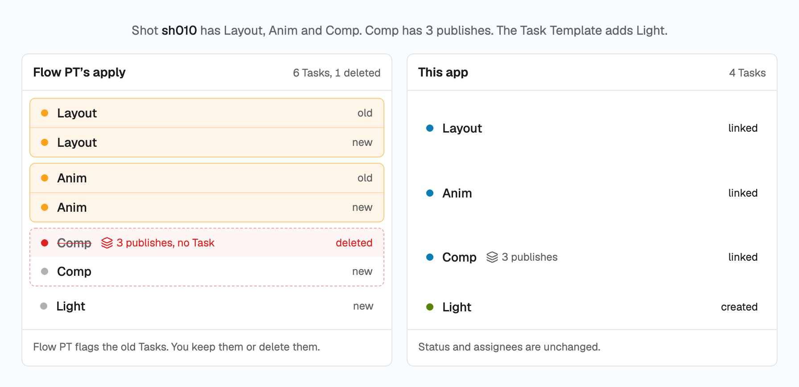

# sg-task-templates

Apply a Task Template to Shots, Assets or any entity that already has Tasks, in Flow Production
Tracking. Tasks are matched by name and Pipeline Step and linked to the template. Only the missing
Tasks are created. Every change is shown per entity before anything is written, and undo is kept per
run.

<picture>
  <source media="(prefers-color-scheme: dark)" srcset="docs/img/merge-dark.png">
  
</picture>

## The ask

Flow PT's own apply matches Tasks by a hidden link, never by name. Switch a Shot to an overlapping
template and every old Task is flagged. Keep them and you get duplicates. Delete them and their
publishes lose their Task. Studios ask for a merge on the forum
([20654](https://community.shotgridsoftware.com/t/20654),
[3237](https://community.shotgridsoftware.com/t/3237),
[18613](https://community.shotgridsoftware.com/t/18613)). No merge option has shipped.

## Try it

<https://sg-task-templates.vercel.app>, after release.

Name your own Flow PT site and approve the request in the tab that opens. The App Session Launcher
signs you in as yourself, the token stays in your browser, and this app's server holds nothing.
Writes land in the event log under your name.

How it works, at `/how` on the site, has the rules: matching, the five outcomes, fields, Tasks not in
the template, dependencies and dates, undo, permissions.

## What it does

- Links each Task with the template task's name and Step, and keeps its status, assignees and
  publishes.
- Creates only the Tasks the entity lacks.
- Lets you keep, overwrite or fill each field the template would rewrite, custom fields included.
- Lists every dependency Flow PT would remove, and re-creates the ones you keep.
- Leaves, omits or deletes the Tasks not in the template. Delete asks twice.
- Shows the plan before any write, and downloads it as CSV.
- Writes one batch per entity. A failure stops that entity only.
- Undoes a run or one entity, from the browser or from the downloaded record.

## How it is built

[sg-widgets](https://github.com/ksallee/sg-widgets), documented at
<https://sg-widgets.vercel.app>: the client (`sg-widgets-core` on npm), the pickers, the tables and
the theme, installed as registry copies.

[sg-groundtruth](https://github.com/ksallee/sg-groundtruth): a corpus of measured Flow PT API
behaviour. Every rule the app rests on is a finding or a recipe there: what the template apply
re-syncs, which dependencies it removes, how undo puts them back. `BRIEF.md` lists them.

## Run it locally

    pnpm install
    pnpm dev

Open the URL Vite prints, name the site and sign in. `docs/development.md` has the rest: the
script key for dev, the seeded sandbox, the checks and the deploy.

`tools/seed.py` seeds test scenarios into a sandbox project:

    uv run --no-project --python 3.11 --with requests python tools/seed.py

A dry run by default: it reports which scenarios are still as seeded. `--write` creates what is
missing; `--reset S04` puts one scenario back after an apply.

`BRIEF.md` is the plan and the decisions.

## Licence

MIT. See `LICENSE`.
